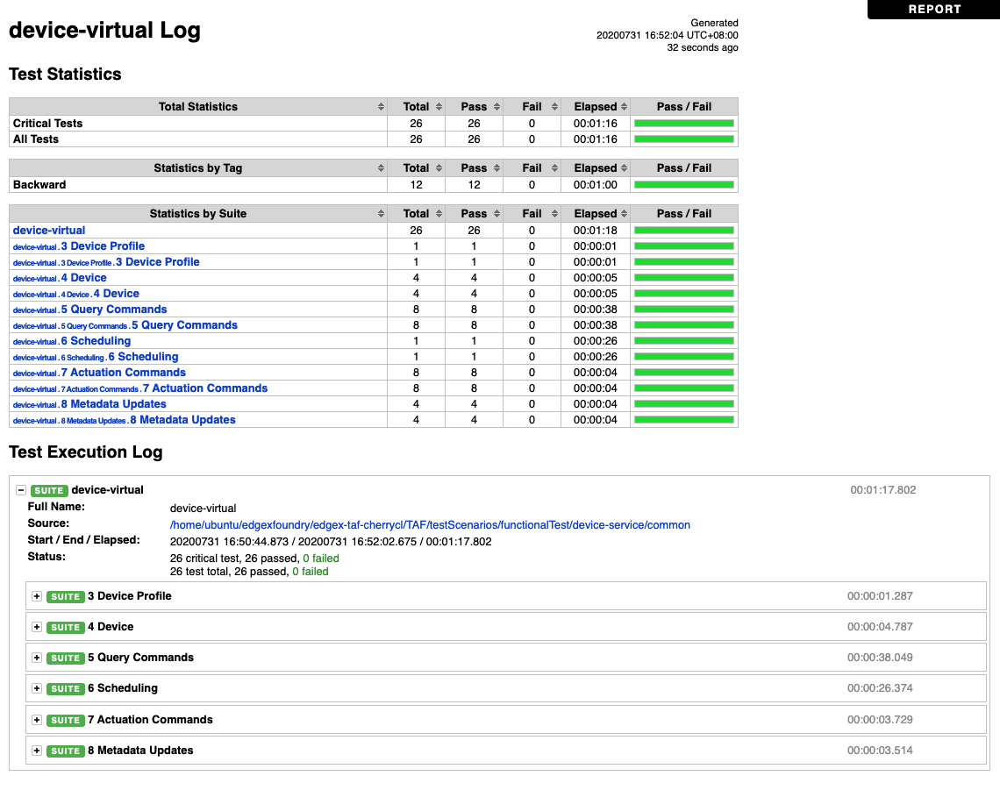
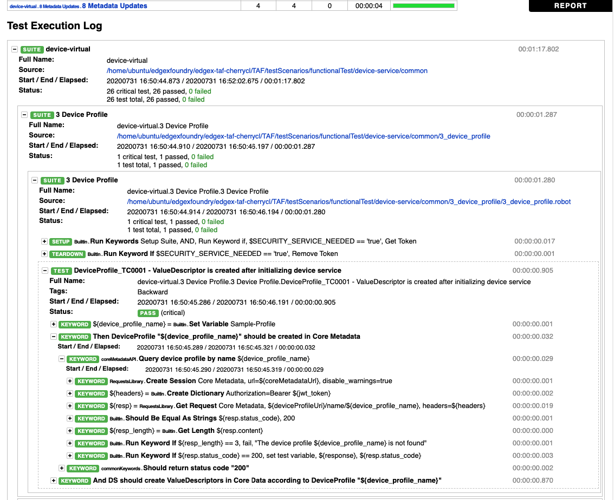
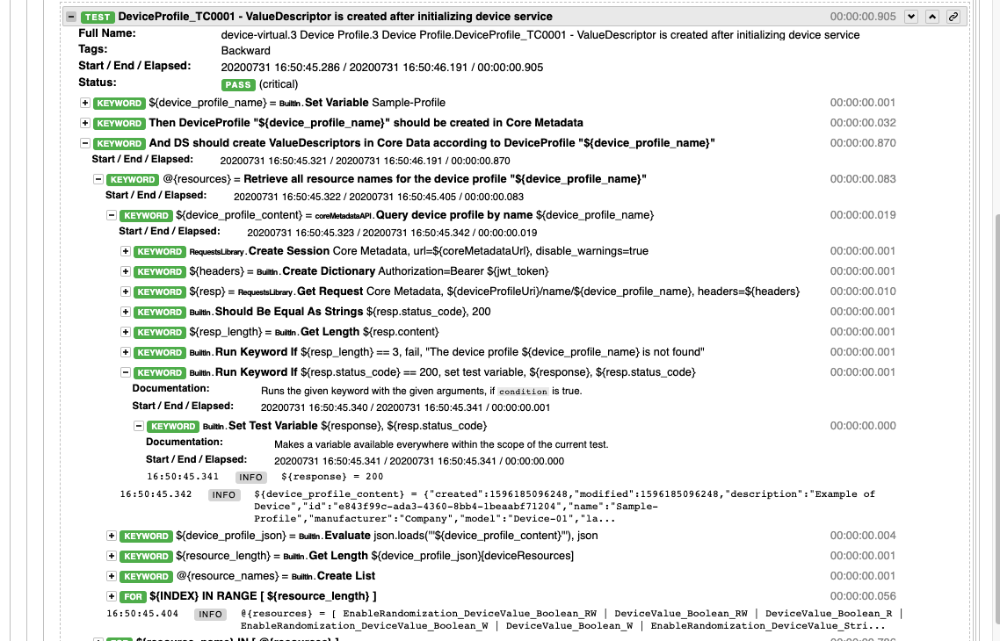

# EdgeX TAF

ITAF Architecture Choices:

- Well -defined Test Code Structure.
- Test application code that narrates the use case scenarios are written using human-readable syntax with ROBOT tool.
- Abstraction of test case code from test application code. Test case code are ROBOT Keywords defined in Python/ROBOT.
- Separation of configuration data from test case application code. Configuration data can be in several formats including JSON, YAML, .cfg etc.
- Separate test logs/reports from test application code.
- Common test code utilities that are documented and catalogued for cross workgroup group reuse.
- Embrace other test aid tools and test scope like JMETER, Selenium, postman, console-cli etc.
- Integration with Jenkins facilitated by TAF Manager

## Overview


- TAF(https://github.com/edgexfoundry/edgex-taf) provides a well-defined project structure for the configuration and test cases, test scripts, and test report
- TAF Common(https://github.com/edgexfoundry/edgex-taf-common) provides a place for reusable scripts and Robotframework usage
- All testing target and dependency should provide the docker image or installation script for automation testing job. For example, device-modbus testing should provide device-modbus docker image and Modbus device simulator docker image or installation script.
- TAF should provide xUnit format testing results which Jenkins server can generate statistics.
    - https://robotframework.org/robotframework/latest/RobotFrameworkUserGuide.html#xunit-compatible-result-file
    - https://plugins.jenkins.io/xunit
- TAF should provide HTML format testing result
    - https://robotframework.org/robotframework/latest/RobotFrameworkUserGuide.html#report-file

## Run TAF Testing
Run tests using python command or edgex-taf-common image depend on install the required libraries for robotframework on testing machine or not. If user don't like to install libraries for testing, the edgex-taf-common image is useful.
### Prerequisites
Clone the edgex-taf project from EdgeX Foundry as a template:
``` bash
git clone https://github.com/edgexfoundry/edgex-taf.git
```
### Using Python Command to Run testing
Navigate to the edgex-taf root path and Run the tests using the following commands
1. Install pre-request packages:
    Download pip3 and run this command:
    ``` bash
    sudo apt-get install python3-pip
    ```
2. Install TAF common:
    ``` bash
    git clone https://github.com/edgexfoundry/edgex-taf-common.git
    
    # Install dependency lib
    pip3 install -r ./edgex-taf-common/requirements.txt

    # Install edgex-taf-common as lib
    pip3 install ./edgex-taf-common
    ```
3. Prepare test environment:
    ``` bash
    # Fetch the latest docker-compose file
    cd edgex-taf/TAF/utils/scripts/docker
    sh get-compose-file.sh ${USE_DB} ${ARCH} ${USE_SECURITY}
    # ex. sh get-compose-file.sh -redis x86_64 -
    
    # Variables for get-compose-file.sh
    ${USE_DB}: -redis | -mongo (mongo is not supported from hanoi release)
    ${ARCH}: x86_64 | arm64
    ${USE_SECURITY}: - (false) | -security- (true)

    # export the environment variables that depend on your machine and use on the following steps.
    export ARCH=x86_64
    export SECURITY_SERVICE_NEEDED=false
    export COMPOSE_IMAGE=nexus3.edgexfoundry.org:10003/edgex-devops/edgex-compose:latest
    ```
4. Deploy edgex:
    ``` bash
    # This step may take for a while if the edgex images don't exist on the machine
    # Execute command under edgex-taf/TAF
    python3 -m TUC --exclude Skipped --include deploy-base-service -u deploy.robot -p default
    ```
5. Deploy Device Service:
    ``` bash
    # Execute command under edgex-taf/TAF
    python3 -m TUC --exclude Skipped --include deploy-device-service -u deploy.robot -p device-virtual
    ```
6. Run testing:
    ``` bash
    # Execute command under edgex-taf/TAF
    python3 -m TUC --exclude Skipped -u functionalTest/device-service/common -p device-virtual
    ```
7. Open the Test Reports
Open the test reports in the browser. For example, to open the testing report, enter the following URL in the browser:
    ``` bash
    edgex-taf/TAF/testArtifacts/reports/edgex/log.html
    ```
8. Shutdown edgex:
    ``` bash
    # Execute command under edgex-taf/TAF
    python3 -m TUC --exclude Skipped --include shutdown-edgex -u shutdown.robot -p default
    ```
### Using the EdgeX-taf-common docker Container

##### Used variable value into the following commands:
``` 
# Used on get-compose-file.sh
${USE_DB}: -redis | -mongo (mongo is not supported from hanoi release)
${ARCH}: x86_64 | arm64
${USE_SECURITY}: - (false) | -security- (true)

# Used on docker command
${COMPOSE_IMAGE}: nexus3.edgexfoundry.org:10003/edgex-devops/edgex-compose:latest
${SECURITY_SERVICE_NEEDED}: false | true
${profile}: device-virtual | device-modbus
```
##### Preparation
1. Get compose file from developer-script repo:
    ``` bash
    cd TAF/utils/scripts/docker
    sh get-compose-file.sh ${USE_DB} ${ARCH} ${USE_SECURITY}
    ```
2. Deploy edgex:
    ``` bash
    docker run --rm --network host -v ${PWD}:${PWD} -w ${PWD} \
        -e COMPOSE_IMAGE=${COMPOSE_IMAGE} \
        -e SECURITY_SERVICE_NEEDED=${SECURITY_SERVICE_NEEDED} \
        -v /var/run/docker.sock:/var/run/docker.sock \
        docker-edgex-taf-common --exclude Skipped \
        --include deploy-base-service -u deploy.robot -p default
    ```
##### Functional Test
1. Deploy Device Service:
    ``` bash
    docker run --rm --network host -v ${PWD}:${PWD} -w ${PWD} \
        -e COMPOSE_IMAGE=${COMPOSE_IMAGE} -e ARCH=${ARCH} \
        -e SECURITY_SERVICE_NEEDED=${SECURITY_SERVICE_NEEDED} \
        -v /var/run/docker.sock:/var/run/docker.sock \
        docker-edgex-taf-common --exclude Skipped \
        --include deploy-device-service -u deploy.robot -p ${profile}
    ```
2. Run testing:
    ``` bash
    docker run --rm --network host -v ${PWD}:${PWD} -w ${PWD} \
        -e COMPOSE_IMAGE=${COMPOSE_IMAGE} -e ARCH=${ARCH} \
        -e SECURITY_SERVICE_NEEDED=${SECURITY_SERVICE_NEEDED} \
        -v /var/run/docker.sock:/var/run/docker.sock \
        docker-edgex-taf-common --exclude Skipped \
        -u functionalTest/device-service/common -p ${profile}
    ```
##### Integration Test
1. Run testing:
    ``` bash
    docker run --rm --network host -v ${PWD}:${PWD} -w ${PWD} \
        -e COMPOSE_IMAGE=${COMPOSE_IMAGE} -e ARCH=${ARCH} \
        -e SECURITY_SERVICE_NEEDED=${SECURITY_SERVICE_NEEDED} \
        -v /var/run/docker.sock:/var/run/docker.sock \
        docker-edgex-taf-common --exclude Skipped \
        -u integrationTest -p device-virtual
    ```
##### Open the Test Reports
Open the test reports in the browser. For example, to open the testing report, enter the following URL in the browser: `TAF/testArtifacts/reports/edgex/log.html`

##### Shutdown EdgeX
``` bash
docker run --rm --network host -v ${PWD}:${PWD} -w ${PWD} \
    -e COMPOSE_IMAGE=${COMPOSE_IMAGE} \
    -v /var/run/docker.sock:/var/run/docker.sock \
    docker-edgex-taf-common --exclude Skipped \
    --include shutdown-edgex -u shutdown.robot -p default
```
## Test Report Example

**Suite level example**



**Test case level example**



**Keyword level example**



## Develop New Device Service Test Script
**Please ignore the step, if you don't need to develop new test for new device-service.**

To write the automation testing for virtual device service, complete the following steps:

### Prerequisites

1.  Clone the edgex-taf project from EdgeX Foundry as a template:

    ``` bash
    git clone https://github.com/edgexfoundry/edgex-taf.git
    ```

2. Install pre-request packages. Download pip3 and run this command:

    ``` bash
    sudo apt-get install python3-pip
    ```

3. Install TAF common:

    ``` bash
    git clone https://github.com/edgexfoundry/edgex-taf-common.git

    # Install dependency lib
    pip3 install -r ./edgex-taf-common/requirements.txt

    # Install edgex-taf-common as lib
    pip3 install ./edgex-taf-common
    ```

### Add configuration

1. Copy the default folder and rename to device-virtual:

    ```
    TAF/config
    ├── README.md
    ├── global_variables.py
    ├── default
    │   ├── configuration.py
    │   ├── configuration.toml
    │   ├── docker
    │   │   └── configuration.toml
    │   └── sample_profile.yaml
    └── device-virtual
        ├── configuration.py
        ├── configuration.toml
        ├── docker
        │   └── configuration.toml
        └── sample_profile.yaml
    ```

2. Modify properties for testing:

    ``` toml
    [TAF/config/device-virtual/configuration.py]

    SERVICE_NAME = "device-virtual"
    SERVICE_PORT = 49990
    ```

3. Provide the configuration.toml file and modify the ProfilesDir property value to "/custom-config":

    ```
    TAF/config
    └── device-virtual
        ├── configuration.toml
        └── docker
               └── configuration.toml

    [Device]
        ...
        ProfilesDir = "/custom-config"
    ```

4. Remove string data type because device-virtual only support boolean, float and integer:

    ```
    [TAF/config/device-virtual/configuration.py]

    SUPPORTED_DATA_TYPES = [
        #     Boolean
        ...
        #     Float
        ...
        #     Integer
        ...
        #     Unsigned Integer
        ...
    ]
    ```

5. Add the protocol properties with name same as ${SERVICE_NAME} on TAF/testData/core-metadata/device_protocol.json, the property key and value are base on the DS implementation::

    ``` json
    {
        "device-virtual": {
            "other": {
                "Address": "simple01",
                "Port": "300"
            }
        }
    }
    ```

6. Add the DS to the docker-compose File

    In this document, we deploy all services using docker, so we must add the docker images to the docker-compose file, as illustrated below:

    ``` yaml
    # TAF/utils/scripts/docker/device-service.yaml
    
    device-virtual:
        image: edgexfoundry/docker-device-virtual-go:1.0.0
        ports:
            - "49990:49990"
        container_name: edgex-device-virtual
        hostname: edgex-device-virtual
        networks:
        edgex-network:
            aliases:
            - edgex-device-virtual
        volumes:
            - db-data:/data/db
            - log-data:/edgex/logs
            - consul-config:/consul/config
            - consul-data:/consul/data
            - ${WORK_DIR}/TAF/config/${PROFILE}:${CONF_DIR}
        depends_on:
            - data
            - command
        entrypoint:
            - /device-virtual
            - --profile=${DS_PROFILE}
            - --registry=${REGISTRY_URL}
            - --confdir=${CONF_DIR}
    ```
### Develop new test case

Put the ROBOT based Test Application code under "use case" folder prefixed with "UC_" in the `TAF/testScenarios` folder.  The robot test case must contain the Settings, Variables and Keywords, the example shown below:

``` bash    
*** Settings ***
Documentation    DS Ping Testing
Library          TAF/testCaseModules/keywords/setup/setup_teardown.py
Library          TAF/testCaseModules/keywords/setup/edgex.py
Library          TAF/testCaseModules/keywords/setup/consul.py
Suite Setup      Setup Suite
Suite Teardown   Suite Teardown
    
*** Variables *** 
${SUITE}                  DS Ping Testing
${LOG_FILE_PATH}          ${WORK_DIR}/TAF/testArtifacts/logs/ds_ping.log
${DEVICE_SERVICE_URL}     http://localhost:${DEVICE_SERVICE_PORT}

*** Keywords ***
# Setup called once before all test cases.
Setup Suite
${status} =  Suite Setup  ${SUITE}  ${LOG_FILE_PATH}  ${LOG_LEVEL}
Should Be True  ${status}  Failed Suite Setup
    
*** Test Cases ***
Test ping API
When Send GET request "/api/v1/ping" to "${DEVICE_SERVICE_URL}"
Then Status code "${REST_RES.status_code}" should be "200"
And Validate ${REST_RES.content} contains version element "1.1.0"
```

### Configuration Profiles

Edgex-taf defines the configuration folder separated by different profiles; the user can trigger the testing using the profile name:
    
```
    TAF/config
    ├── device-modbus
    └── device-random
```
    
For example, to run the DS testing for **device-random**:
    
``` bash
    python3 -m TUC -p device-random -u functionalTest/device-service/common
```
    
Or to run the DS testing for **device-modbus**:
    
``` bash
    python3 -m TUC -p device-modbus -u functionalTest/device-service/common
```

### How to use the configuration in the testing script

Define constant in the configuration.py:
    
``` python
#global_variables.py
    # EdgeX host
    BASE_URL = "localhost"
    
# configuration.py
    # Service for testing
    SERVICE_NAME = "device-virtual"
    SERVICE_PORT = 49990
```
    
Pass the constant to the robot file or python code:
    
``` python
# coreCommandAPI.robot
*** Variables ***
${coreCommandUrl}  http://${BASE_URL}:${CORE_COMMAND_PORT}
    
# startup_checker.py
conn = http.client.HTTPConnection(host=SettingsInfo().constant.BASE_URL, port=d["port"], timeout=httpConnTimeout)
```
    
Reference the following URL for more details on variables usage
https://robotframework.org/robotframework/latest/RobotFrameworkUserGuide.html#variable-priorities-and-scopes

### Python System Path Setup

We use the project root path as the system path. The python module names are **TAF**.

The usage for robot file is:  
```
# TAF/testScenarios/functionalTest/deploy-edgex.robot
   
*** Settings ***
Documentation    Deploy EdgeX
Library          TAF/testCaseModules/keywords/setup/setup_teardown.py
Library          TAF/testCaseModules/keywords/setup/edgex.py
```  
The usage for python script is illustrated below:
    
```
TAF/testCaseModules/keywords/setup/edgex.py
    
from TUC.data.SettingsInfo import SettingsInfo
import startup_checker as checker
```

## Use different deploy type
Default deploy type set to "docker" which means deploy edgex by docker. If user deploy edgex using snap. Modify the following files.
1. globle_variables.py
    ```
    # Deploy type: docker, manual, snap
    DEPLOY_TYPE = "docker"
    ```
2. Files on TAF/utils/scripts/snap
There are empty files in the snap folder, please add the related snap command into files.
